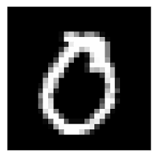
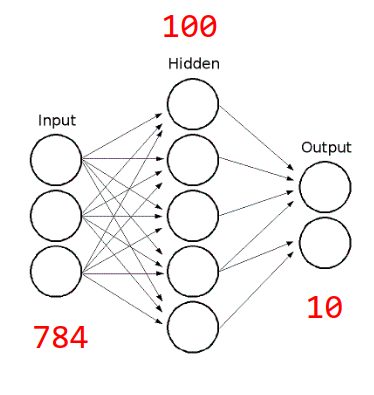
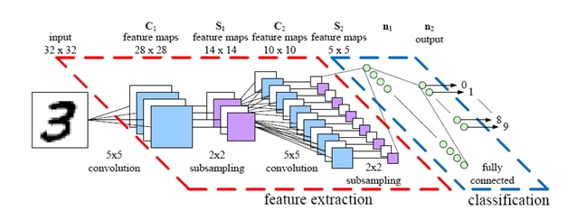

# Redes Neurais Convolucionais Utilizando PyTorch #

Hoje iremos construir uma rede neural convolucional utilizando PyTorch para isso.

Primeiro iremos escolher nosso conjunto de dados. Existem diversos conjuntos de dados na comunidade, alguns tão famosos que já estão diponíveis em _frameworks_ como o PyTorch você pode encontrá-los [aqui](https://pytorch.org/docs/stable/torchvision/datasets.html).

Para este pequeno exemplo utilizaremos o MNIST ([_Modified National Institute of Standards and Technology database_](https://en.wikipedia.org/wiki/MNIST_database)). O MNIST é conjunto de dados muito utilizado pela comunidade de computação visual para experimentação de modelos de classificação de imagens. Ele traz consigo diversas características que buscamos em conjunto de dados como por exemplo (mas não somente):

* Grande quantidade de dados;
* Dados normalizados;
* Dados anotados.

Exemplo de dados do MNIST

Podemos olhar uma imagem individualmente do conjunto de dados e teremos algo como:

Uma instância do MNIST

Para utilizar os dados do MNIST iremos reutilizar um dos DataLoaders implementados nas aulas anteriores. eles estão disponíveis no arquivo [data.py](src/data.py)

Iremos implementar duas redes neurais para trabalhar em cima do MNIST. A primeira será uma rede neural normal, apenas com camadas totalmente conectadas (_fully connected_), ela seguirá o modelo ilustrado na imagem abaixo. Para ver a implementação você pode dar uma olhada no arquivo [fc.py](src/fc.py)

Rede neural totalmente conectada que iremos implementar

Os resultados obtidos podem ser vistos no jupyter notebook [resultados.ipynb](src/resultados.ipynb)

Bom agora iremos implementar um modelo para trabalhar no mesmo MNIST utilizando agora redes neurais convolucionais que mostram seu pontencial para trabalhar em imagens. Iremos implementar a rede ilustrada na imagem abaixo.

Rede neural convolucional iremos implementar. <a href="http://parse.ele.tue.nl/education/cluster2
">Fonte</a>

Novamente os resultados podem ser observados no jupyter notebook [resultados.ipynb](src/resultados.ipynb)